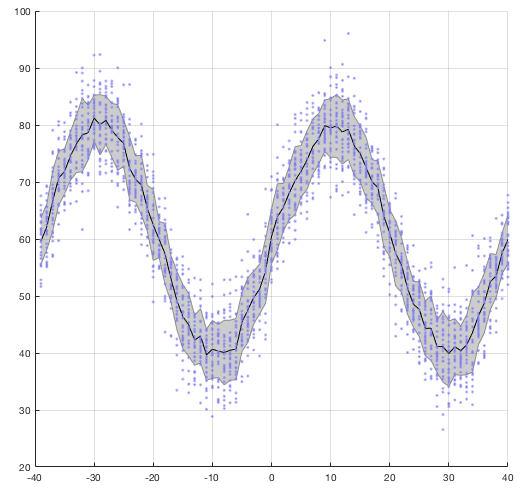
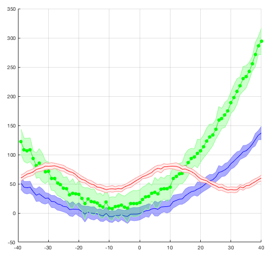
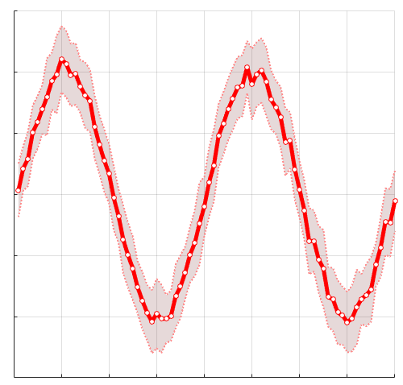

# shadedErrorBar

`shadedErrorBar` is a MATLAB function that creates a continuous shaded error region around a line rather than discrete bars. 
The error region can either be specified explicitly or calculated on the fly based upon function handles. 
The appearance of the plot can be modified via input argumets and/or the handles of the returned plot objects.
You will need OpenGL to get transparency to work.


# Examples

### Basic example with overlaid points
```
% Prepare data
y=randn(30,80)*5;
x=(1:size(y,2))-40;
yP = sin( linspace(-2*pi,2*pi,length(x)) )*20;
y = bsxfun(@plus,y,yP)+60;

% Make the plot
clf
shadedErrorBar(x,y,{@mean,@std}); 

% Overlay the raw data
hold on
plot(x,y,'.','color',[0.5,0.5,0.95])

grid on
```



### Overlaying multiple lines
```
% Prepare data for first line
y=ones(30,1)*x; 
y=y+0.06*y.^2+randn(size(y))*10;

clf
shadedErrorBar(x,y,{@mean,@std},'lineprops','-b','patchSaturation',0.33)

% Overlay second line
hold on
shadedErrorBar(x,2*y+20,{@mean,@std},'lineprops',{'-go','MarkerFaceColor','g'});

%Overlay third line
y=randn(30,80)*5; 
x=(1:size(y,2))-40;
yP = sin( linspace(-2*pi,2*pi,length(x)) )*20;
y = bsxfun(@plus,y,yP)+60;

% Make this line non-transparent
shadedErrorBar(x, y, {@mean,@std}, 'lineprops', '-r','transparent',false,'patchSaturation',0.075)

grid on
```



### Modifying plot properties post-hoc
```
% Prepare data
y=randn(30,80)*5; 
x=(1:size(y,2));
yP = sin( linspace(-2*pi,2*pi,length(x)) )*20;
y = bsxfun(@plus,y,yP);

% Plot
clf
s = shadedErrorBar(x, y, {@mean,@std}, 'lineprops', '-r');

% Set face and edge properties
set(s.edge,'LineWidth',2,'LineStyle',':')
s.mainLine.LineWidth = 5;
s.patch.FaceColor = [0.5,0.25,0.25];

% Overlay data points post-hoc
hold on
plot(s.mainLine.XData, s.mainLine.YData,'or','MarkerFaceColor','w')

grid on

set(gca,'XTickLabel',[],'YTickLabel',[])
```




# Change Log

24th November 2017
* Add `patchSaturation` as an optional argument.

6th August 2017

* Parameter/value pairs for input arguments greater than 3.
* Transparency on by default.
* No longer changes the renderer.
